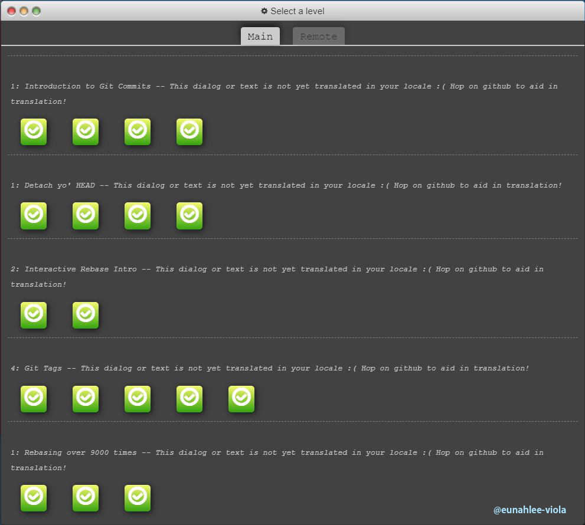
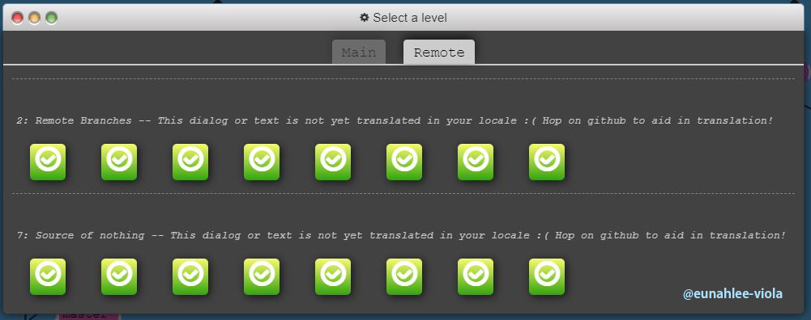
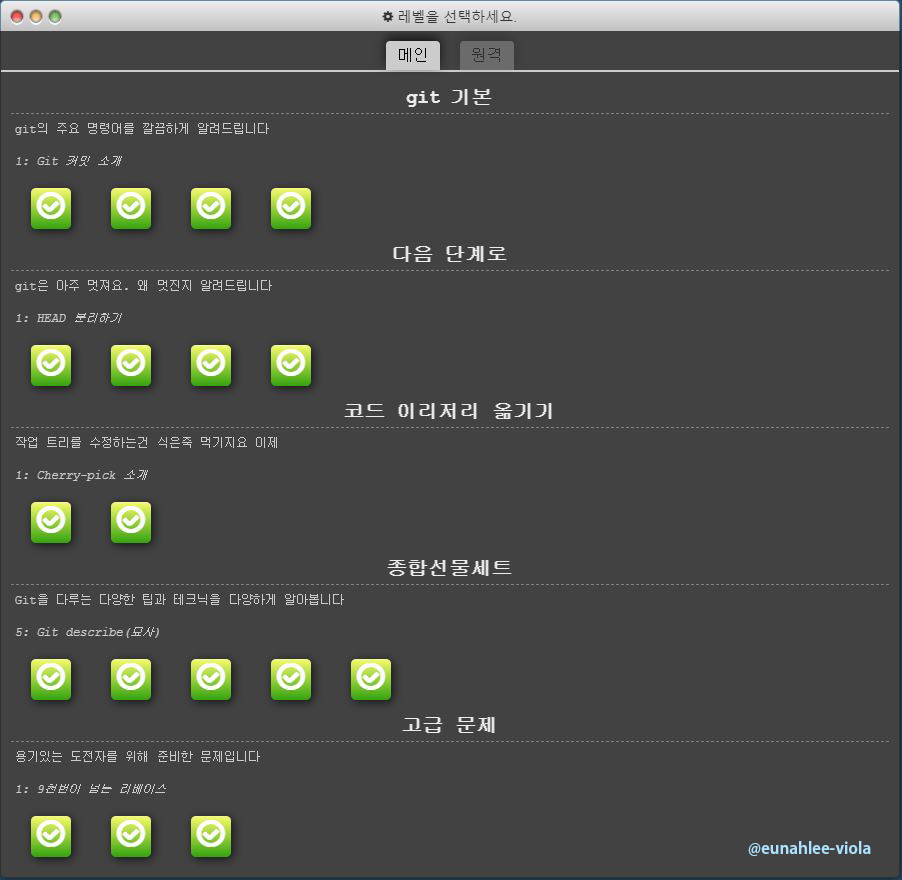
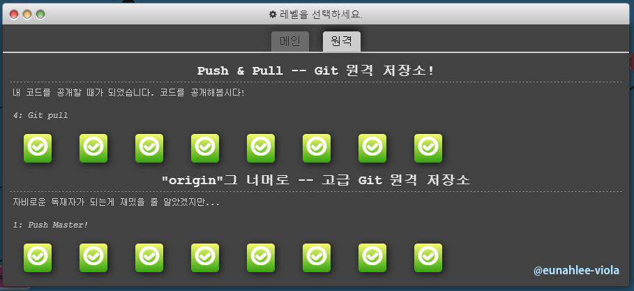

# 과제 2 (난이도 중)

 
## 과제 완료 캡쳐 화면

너무 재미있어서 오류생겼을 때 카페에서 공유해주신 영어 사이트와 한글사이트 모두 완료했습니다!

## 응원의 말

여기 있는 명령어를 모두 외우지 않아도 괜찮습니다. git으로 어떤 작업을 할 수 있는지 정도만 알아 두었다가, 필요할 때 다시 Learn Git Branching 사이트로 돌아와 가상 환경에서 실습한 후 실무에 적용하는 개발자들이 많습니다. 겁먹지 마세요!

