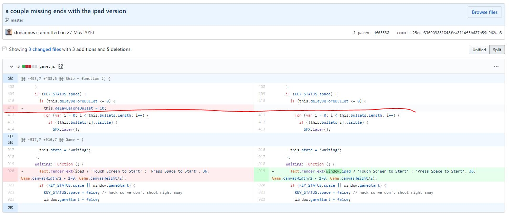
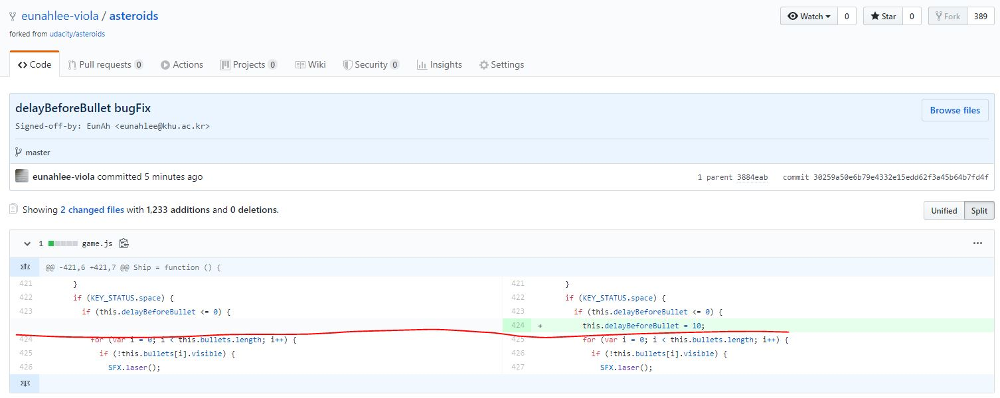

# 과제 3 (난이도 상)

https://github.com/udacity/asteroids 에 들어가 해당 리포지토리를 로컬 머신에 클론 받고 다음 과제를 수행해주세요.

## 버그를 유발한 커밋 찾기

asteroids를 실행하면 우주선과 소행성이 나타납니다. 키보드에서 ←와 →를 누르면 우주선이 가리키는 방향이 바뀌고, ↑를 누르면 우주선이 전진합니다. 스페이스 바를 누르면 로켓이 발사되죠. 

엇! 그런데 에러가 있네요. 스페이스 바에서 손을 떼지 않고 계속 눌러봅시다. 쉼 없이 총알이 발사됩니다. 

이렇게 끊임없이 총알이 발사되면 게임을 금방 깰 수 있어서 안 됩니다. 처음엔 총알이 끊임없이 발사되지 않도록 구현했었는데, 어디선가 총알이 끊임없이 발사되도록 하는 코드가 들어간 것 같네요.

어떤 커밋때문에 버그가 생겼는지 찾아봅시다. 그리고 버그를 수정하려면 어떻게 해야 하는지 적어봅시다.

### 정답

1. 버그를 유발한 커밋의 ID: 25ede836903881848fea811df5b687b59d962da3 'a couple missing ends with the ipad version'
2. 버그를 수정하는 방법: 
  - 최근 커밋부터 되돌아가면서 각각의 상태에서 index.html을 들어가서 총알의 상태가 바뀌는 지점에서의 코드를 아래와 같이 확인했습니다. 

  - 메모장에서 game.js를 열어 실수로 삭제된 1줄을 다시 입력하고 아래의 명령어를 차례로 입력하여 fork 받은 repositeory에 push했습니다.  
   $ git add game.js 
   $ git push -u origin master 
   $ git commit -sm 'delayBeforeBullet bugFix' 
   $ git push origin master 
  - 결과로 수정된 commit의 내용은 아래와 같습니다. (pull-request는 하지 않았습니다.^^)  

  
### 힌트
과제 2를 통해 커밋도 체크아웃 할 수 있다는 것을 배웠습니다. 이전 커밋을 체크하웃하면 타임머신을 타고 과거로 돌아갈 수 있습니다!

힌트 감사합니다~ ^^
